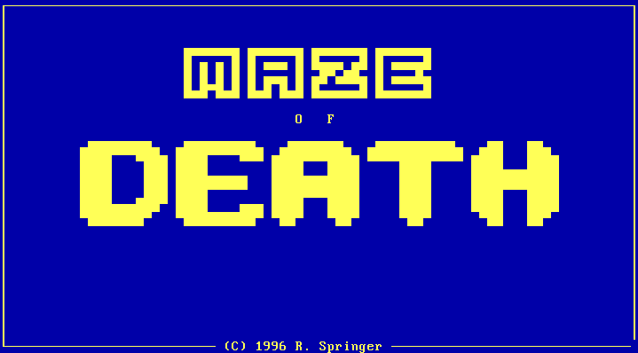
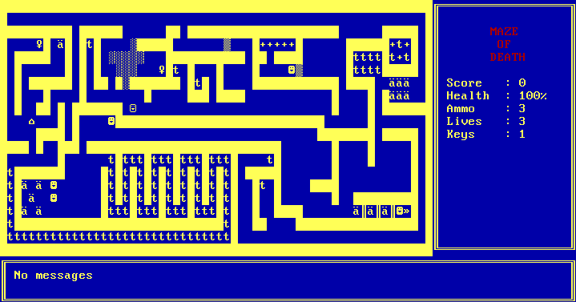

# maze

I wrote this game back in 1996, and it was quite a big project for me at the time. It's a text-mode pacman-clone with some nice minor additions, written in Turbo Pascal. This code is public domain and should still work fine on my computers.

# Screenshots

Title screen

First and only level

## Downloads

  * [Source code and executable](releases/maze.zip) (16KB)
